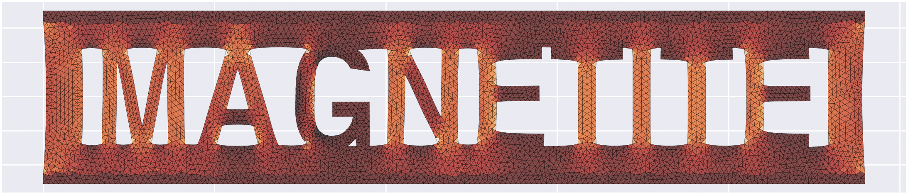

# Magnetite

A 2D linear-elastic FEA program for isotropic materials, built in Rust.

## Overview

Magnetite is a simple linear-elastic mechanical solver for isotropic 2D models. Here's how it works:

1. First, we give Magnetite two things: an input json and a geometry file

   - The input json is explained in greater detail below; it lays out boundary conditions and other parameters for the simulation, including part-thickness and material elasticity.
   - The geometry is provided via an `svg` file. There's some limitations to what Magnetite supports, and this is covered below too. Optionally, you can provide CSV files of vertices, but this method tends to be convoluted.

2. Next, Magnetite rebuilds your geometry into a `.geo` file. This allows us to use [Gmesh](https://gmsh.info)—an open source meshing program—to create a mesh of the geometry using [Delaunay triangulation](https://en.wikipedia.org/wiki/Delaunay_triangulation).

   > Gmesh is a vastly equipped piece of software. The algorithm Magnetite uses is Delaunay-based, but many mesh conflicts are resolved by other Gmesh algorithms.

3. After parsing the geometry into a `.geo` file, Magnetite runs Gmesh to create a `.msh` mesh.
4. After the meshing has finished, Magnetite parses the mesh output into a list of Nodes and Vertices. At this time, it will apply boundary conditions listed in the input json.
5. Once the mesh has been parsed, it's onto solving. A lot happens under the hood, and the process is [documented in detail here](under-the-hood.md).
6. After solving the system, we post-process the system to solve for stresses, then we output the results as a `nodes.csv` and `elements.csv`.
7. Finally, Magnetite triggers a Python script to plot these elements in [matplotlib](https://matplotlib.org/).

### Example Output

Here's a fun example I did with the LinedIn logo. This mesh is pretty fine, but it only took Magnetite 0.286 seconds to solve on my not-so-special MacBook Air.


## Installation and Running

It's important to build this crate in release mode. The underlying linear algebra accelerators don't seem to trigger in dev mode, meaning that everything will work in dev—just very slowly.

To install Magnetite, run:

```
git clone https://github.com/kyle-tennison/Magnetite.git; cd Magnetite
cargo build --release
```

Then, optionally, you can alias the binary:

```
alias magnetite=target/release/magnetite
```

You will also need [Gmsh](https://gmsh.info/#Download) installed on your machine.

### Running Example

Try running the example above! Go to `examples/cover-example` and run the following:

```
magnetite input.json geom.svg --cmap gist_heat
```

The `cmap` flag is optional; it tells us to use the `gist_heat` colormap when plotting
our results in matplotlib. All [matplotlib colormaps](https://matplotlib.org/stable/users/explain/colors/colormaps.html) are supported.

Magnetite has some other options. Run the following to display the help page:

```
magnetite -h
```

## Geometry Files

Geometry can be provided in two ways:

- As an `.svg` file
- As a _series of_ `.csv` files

In both cases, **geometry is limited to simple regions**, meaning that regions _can_ have holes, but they must contribute to the same "part."
To facilitate this requirement, Magnetite needs **one external region** and **any number of internal regions** (including none).

### SVG Files

The easiest way to generate a `.svg` file for Magnetite is through [Adobe Illustrator](https://www.adobe.com/products/illustrator.html); however, this product is far-from free. If you don't have access to Illustrator, another vector art program should suffice.

Currently, Magnetite supports the following SVG elements:

- `rect`
- `polyline`
- `polygons`

Unfortunately, this means that other common elements are **not** currently supported. This includes, but is not limited to:

- `path` ([Includes Bézier](https://www.w3schools.com/graphics/svg_path.asp))
- `circle`
- `elipse`

> Eventually, I hope to support these elements, but my priorities with this project are elsewhere.

In illustrator, if you exclusively use the rectangle and pen tool (without splines), your geometry should be parsed correctly.

The example above was created in illustrator:


Again, Magnetite needs **one external** region and any number of **internal** regions. The green in the image above shows the **external** region, which wraps the yellow **internal** regions. These interal regions will be "cut" out of the final geometry.

To tell Magnetite what's internal versus external, we simply name the layers `INNER` or `OUTER`—respectively:


It's not pretty, but it works. Eventually, Magnetite might support `.dxf` drawings.

> Notice how there's a few leftover layers? That's perfectly fine. Any layers that aren't named `INNER` or `OUTER` will be ignored.

We can export this document as a `.svg`, then we're ready to run a simulation on it!

> If two vertices are closer than the minimum element length specified in the input json, one will be removed. If something ends up looking jagged, try refining the mesh.

### CSV Files

CSV files are simpler to use, but they are cumbersome to create. These CSV files only have two fields, x & y, which detail the vertices in the model. The ordering of these vertices defines the connections between them.

```csv
x,y
-11,4.5
-10,4.5
-9,4.5
-8,4.5
-7,4.5
...
```

CSV Files follow the same OUTER-INNER requirements defined above. Magnetite will always require **one external** geometry, and any number of additional **internal geometries**.

For instance, say we have an `external.csv` for our outer region, then `internal_1.csv` and `internal_2.csv`. To tell Magnetite which geometry is which, we need to **pass the external geometry first**. In this scenario, that would look like:

```
magnetite input.json external.csv interal_1.csv internal_2.csv
```

## Input Json

The actual simulation is defined in an input json. Let's break down the following example:

```json
{
  "metadata": {
    "part_thickness": 0.5,
    "material_elasticity": 69e9,
    "poisson_ratio": 0.33,
    "characteristic_length_min": 0,
    "characteristic_length_max": 0.9
  },
  "boundary_conditions": {
    "restraint": {
      "region": {
        "x_target_min": -12,
        "x_target_max": -10
      },
      "targets": {
        "ux": 0,
        "uy": 0,
        "fx": null,
        "fy": null
      }
    },
    "load": {
      "region": {
        "x_target_min": 10,
        "x_target_max": 12
      },
      "targets": {
        "ux": null,
        "uy": null,
        "fx": -6e8,
        "fy": 0
      }
    }
  }
}
```

### Metadata

The metadata field defines the properties of the simulation. All the fields shown (i.e., part_thickness, material_elasticity, etc.) are required for each simulation.

These fields describe:

- `part_thickness` – The thickness of the part
- `material_elasticity` – The Young's Modulus of the part
- `characteristic_length_min` – (Effectively) The minimum mesh element size
- `characteristic_length_max` – (Effectively) The maximum mesh element size

### Boundary Conditions

Here, we specify boundary conditions for the simulation. In the example above, we define two boundary conditions, `restraint` and `load`. We can name these whatever we like.

Each boundary condition must have two fields: `region` and `targets`

#### Region

Boundary conditions are applied by rectangular-region; if a node falls within this region, the `targets` will be applied to it.
By default, the region is $\mathbb{R}^2$; we restrict it with:

- `x_target_min`
- `x_target_max`
- `y_target_min`
- `y_target_max`

We are effectively saying: $R=\\{(x,y)\in{\mathbb{R}^2|x_{target-min} ≤x≤ x_{target-max}, y_{target-min} ≤y≤ y_{target-max}}\\}$

> Values left undefined will default to $\infty$.

#### Target

If a node falls within the region, the parameters defined here will be applied to that node. As with the `metadata` section, all fields in the `target` section must be defined.

To create a properly constrained model, there must be one unknown in each axis. For instance, in this example, the external forces `fx` and `fy` are known in the $x$ and $y$ axes; therefore, we _must_ leave `ux` and `uy` as `null`. If we over- or under-define our model, Magnetite will error.

## Citations

The equations used to obtain stiffness matrices were derived in this [University of New Mexico Paper](https://www.unm.edu/~bgreen/ME360/2D%20Triangular%20Elements.pdf).

Other references are made to this [Indian Institute of Science Paper](https://mecheng.iisc.ac.in/suresh/me237/feaNotes/Chapter2.pdf).

More information is found on this [Wikipedia page](https://en.wikipedia.org/wiki/Finite_element_method)

## More

Magnetite is a Rust-adapdation of my Python-based solver [Pyrite](https://github.com/kyle-tennison/Pyrite). Eventually, I hope to build a 3D solver, and Magnetite will be the starting-place for that.

These isotropic linear-elastic solvers are stepping stones, and eventually, I hope to use them for some pretty ambitious projects.

A lot more of how this solver works is documented in ["under the hood."](under-the-hood.md) If you're interested, check it out!
