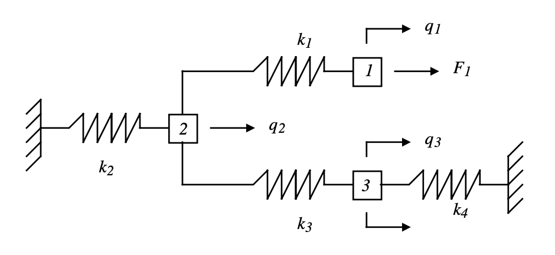
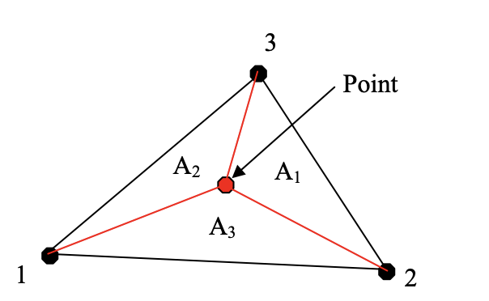

# Under The Hood

How Magnetite functions.

Magnetite covers meshing, solving, and post-processing—all in one program. Let's break it down.

## Meshing

If you haven't already, checkout the [main readme](readme.md); this details how you can submit geometry into Magnetite.

The goal of meshing is to turn our 2D model into Nodes and Elements. Nodes are effectively just points (with some extra metadata), and elements are triangles made from three Nodes. Thats not bad, is it?

Magnetite supports both CSV inputs and SVG inputs. In both cases, the desired end result is a vector of vectors of Nodes. We need a vector of vectors because we need a way to differentiate between external geometry and internal geometry. Because we know that there's only ever going to be one external geometry, we can reserve the 0th index of this vector of vectors for the collection of vertices defined in the outer geometry; all of the following indices will be filled by internal geometry.

Once we've established the nodes in the model, we can translate them into a `.geo` file. This will serve as the input to `Gmsh`. There is a [Gmsh SDK for Rust](https://docs.rs/gmsh-sys/latest/gmsh_sys/), but this method had the benefit of debugging the .geo file at will. At some point, I may switch to this method as it's objectively better.

With the `.geo` file in hand, we can run `gmsh geom.geo -2 -o geom.msh` to get our `geom.msh`. Simple enough!

Next, we open up the `geom.msh` file and start parsing it. There are a few different sections in a `.msh` file, but we are concerned with the `$Elements` section and the `$Nodes` section. First, we'll register the nodes, then the elements. There's some tricks we follow to ignore elements from other dimensions, and, thanks to the [`.msh` file format](https://gmsh.info/doc/texinfo/gmsh.html#MSH-file-format) being so developer-friendly, this is no issue.

Once we have established the nodes and elements in our model, we're ready to apply the boundary conditions described in the input json. We'll loop though the nodes and check its position against all of the registered boundary rules. If the number boundary conditions stay constant, the time complexity remains at $O(n)$.

Once we've finally parsed all of the nodes and elements in our model, we're ready to solve. But wait, how do we solve something like this?

## Solver Math

The math in this solver is based heavily on this [University of New Mexico Paper](https://www.unm.edu/~bgreen/ME360/2D%20Triangular%20Elements.pdf), plus some other resources. For a comprehensive list of citations, view the bottom of the [main readme](reamde.md).

### The Finite Element Method

My personal favorite law in physics is Hooke's law. It says:

$$F=-kx$$

$F$ is force, $k$ is stiffness, and $x$ is displacmement. Put simply, this states that the force that a spring exerts is proportional to the distance it's compressed. 

Ok, so what's the big deal? Spring's alone aren't that interesting, but what's cool is that _everything is a spring_. In school, we're taught that the reason why we don't fall through the floor is due to "the normal force" — and this is ture! But what _is_ the normal force? It's just Hooke's law! When you walk down the road, you compress it, just enough for it to respond with the force to match your weight. As with everything, there's cavitates to this, but the world becomes much simpler with a linear-elastic lense.

So, if everything is a spring, why don't we represent our model as one big spring? Well, if we can, we do! In engineering statics, we say $\sigma = E \ \epsilon$, or stress is equal to elasticity times strain. This is just a fancy way of stating Hookes law, and this relationship (along with some others) allows us to derive all sorts of equations for predicting the behavior of simple geometries.

But, what happens when the geometry gets too complicated? You'd be hard-pressed to derive an equation for your three-story building using simple stress-strain relationships. This is where the finite-element method (FEM) comes into play. If we break down complex geometries that we are unable to solve into thousands of elements that we _can_ solve, we are able to create a system of equations that governs the reveals the behavior of the system as a whole. This looks like:

$$\{F\}=[K]\{U\}$$

Here, $\{F\}$ is a column vector of _nodal forces_ (i.e., the forces applied to each node) and $\{U\}$ is a column vector of _nodal displacements_ (i.e., the displacement of each node). $[K]$ is a matrix that describes the stiffness of the matrix. Do you notice the similarity? This is effectively Hooke's law, just a bit fancier!

### What we're solving for

Before we get too deep into the math, let's go back to Hooke's law again.

$$ F = -kx $$

Consider what happens when we compress the string over a distance $d$. The force linearly increases as we push, and when we're done, we've put some energy into the system. Mathematically, this looks like:

$$W=k\int\limits_0^qx\ dx=\frac12kq^2$$

If we were to consider $x=0$ the equilibrium point of the spring, we can state that, for any compression, the potential energy in a spring is given by:

$$ KE_{sp}=\frac12kq^2 $$

... where $k$ is the spring stiffness and $q$ is the displacement.

Cool, but what's the significance? If we know the potential energy for an element in our system, we can leverage the [The Principle of Minimum Potential Energy (MPE)](https://mecheng.iisc.ac.in/suresh/me237/feaNotes/Chapter2.pdf) to arrive at a stiffness matrix. This principle states:

> For conservative structural systems, of all the kinematically admissible deformations, those corresponding to the equilibrium state extremize (i.e., minimize or maximize) the total potential energy. If the extremum is a minimum, the equilibrium state is stable

In other terms, the deformations that _minimize_ the potential energy are the equilibrium deformations; because we're building a static mechanical simulator, we are interested in the static (i.e., stable) solution, which is found at the MPE.

> Note: this assumes total potential energy, including _work potential_—i.e., the opposite of work done on the system by external systems. For this reason, potential energy, for a 1D spring system, is represented as $U=U_{sp}+WP$ — where $WP$ is work potential.

For instance, consider the following system of springs (from Indian Institute of Science):


> This image is missing $F_3$; it is applied to the lowest arrow attached to the [3] block.

We are interested in solving for the equilibrium displacements for $q_1, q_2, q_3$. If we find the spring potential energy for each spring, then sum the result, we can say that the spring potential energy is:

$$KE_{sp}=\frac12(k_1(q_1-q_2)^2+k_2q_2^2+k_3(q_3-q_2)^2+k_4q_3^2)$$

We need to also consider the work done on the system by external forces. Work is force times distance (assuming force is constant), so we can say that the two forces do the combined work on this system:

$$F_1q_1+F_3q_3$$

Remember, work potential is the _opposite_ of the work done on the system by external forces. Therefore, the total potential energy is:

$$KE=KE_{sp}+WP=[\frac12(k_1(q_1-q_2)^2+k_2q_2^2+k_3(q_3-q_2)^2+k_4q_3^2)]+[-F_1q_1-F_3q_3]$$

As stated in the principle of MPE, the potential energy for each $q$ should be an extrema. Thus, we assert that the partial derivative of the equation above with respect to each $p$ should equal zero. I'll skip over some of the math (which is shown [here](https://mecheng.iisc.ac.in/suresh/me237/feaNotes/Chapter2.pdf)), but in the end, we arrive at the system of equations:

$$
\begin{bmatrix}
F_1 \\ 0 \\ F_3 \\
\end{bmatrix}=
\begin{bmatrix}
k_1 & -k_1 & 0 \\ 
-k_1 & k_1+k_2+k_3 & -k_3 \\
0 & -k_3 & k_3+k_4
\end{bmatrix}
\begin{bmatrix}
q_1 \\
q_2\\ 
q_3
\end{bmatrix}
$$


We now have a system we're able to solve. This derivation is for a 1D spring system, but we can follow the same steps to arrive at a stiffness matrix for planar elements.

1. Obtain an equation potential energy 
2. Apply the Principle of MPE
3. Factor out displacements to create a stiffness matrix
4. Setup the equation in the form $\{F\}=[K]\{u\}$

### 2D Stress Elements

Before we get started working with 2D elements, we'll need to consider some new properties at arise with the increased dimension. Let's look at 1D Hooke's law again, in it's stress-strain form:
$$\sigma = E \epsilon$$

where:
- $\sigma$ is stress
- $\epsilon$ is strain
- $E$ is the material elasticity (Young's Modulus)

Let's see how this changes when we move to 2D. 

First, let's look at a stress element in 2D:


The symbols represent:
- $\sigma$ – normal stress
- $\tau$ – shear stress

We'll also need to look at the [poisson ratio](https://en.wikipedia.org/wiki/Poisson%27s_ratio), which is dependent on the material of the element. This ratio measures ($v$) the Poisson effect, which is the phenomena that occurs when a material is stretched:


When the green block is stretched, it becomes thinner in its other axes; the magnitude of this effect is described by poisson ratio.

Now, we have the following definitions for the properties that define a 2D stress element:
- Axial Stress ($\sigma$)
- Axial Strain ($\epsilon$)
- Shear Stress ($\gamma$)
- Shear Strain ($\gamma$) (not shown above, [described here](https://en.wikipedia.org/wiki/Strain_(mechanics)#Shear_strain))
- Young's Modulus ($E$) (also not shown, [described here](https://en.wikipedia.org/wiki/Shear_stress))
- Poisson Ratio ($v$)

### Triangular Elements

2D square elements are simple enough, but we're dealing with triangles—that makes things a bit more tricky. Let's examine how a triangle behaves when it's stressed.

Triangles have three vertices, which we call nodes. Each node can deform in the $x$ and $y$ axes. We can represent the local displacement of a triangular element as the following column vector:

$$u_e = 
\begin{bmatrix}
u_{1x} & 
u_{1y} &
u_{2x} &
u_{2y} &
u_{3x} &
u_{3y}
\end{bmatrix}^T$$

Now, let's consider what happens when the triangle deforms. There's a few ways to approach this problem, but the simplest way is to interpolate stress over the area of the triangle. This approach sacrifices accuracy, but its a reasonable approximation for small displacements. To apply this theory, we split the element into three sub-triangles with a common vertex at the interior point of the element:


> From University of New Mexico

Considering that the area of the element is the sum of the $A_1, A_2, A_3$, we can create the following shape functions:

$$N_1=\frac{A_1}{A},N_2=\frac{A_2}{A},N_3=\frac{A_3}{A}$$


Because $N_1, N_2, N_3$ are ratios of $A$, the sum of $N_1+N_2+N_3=1$. Thus, if we let $\xi=N_1$ and $\eta=N_2$, we can solve for the other item, $N_3 = 1- \xi - \eta$.

With these definitions, we can estimate the displacements in the element with:

$$u_{ex}={N_1u_{1x}+N_2u_{2x}+N_3u_{3x}}=(u_{1x}-u_{3x})\xi+(u_{2x}-u_{3x})\eta + u_{3x}$$
$$u_{ey}={N_1u_{1y}+N_2u_{2y}+N_3u_{3y}}=(u_{1y}-u_{3y})\xi+(u_{2y}-u_{3y})\eta + u_{3y}$$

And, we can also solve for the position of interior point:
$$x=N_1x_1+N_2x_2+N_3x_3=(x_1-x_3)\xi+(x_2-x_3)\eta+x_3$$
$$y=N_1y_1+N_2y_2+N_3y_3=(y_1-y_3)\xi+(y_2-y_3)\eta+y_3$$

This will allow us to do some cool stuff in a moment—hang in there.


### Setting up our Problem

Finding the potential energy in a spring element is pretty simple; however, the process becomes a lot more complex for 2D elements. We use the same idea of integrating the force over displacement, as we did for the spring, for the plane as well. Instead of looking the force, we'll look at the stress $\sigma$, and instead of looking at the displacement, we'll look at the strain $\epsilon$. Thus, over the volume of a triangular slab, we can say:

$$ PE = \frac 12 \iiint_V \epsilon^T \sigma\ dV $$

However, we want our model to be defined in two dimensions. If we assume a constant thickness $t$, we can state:

$$ PE = \frac12 \iint_A \epsilon ^T \sigma\ t\ dA $$

Remember, we're working in 2D, so $\sigma$ and $\epsilon$ are both matrices:

$$\sigma=\begin{bmatrix}\sigma_x\\\sigma_y\\\tau_{xy}\end{bmatrix}, \ \epsilon = \begin{bmatrix}\sigma_x\\\sigma_y\\\gamma_{xy}\end{bmatrix}$$

Our goal is to define stress and strain so that we can apply the Principle of MPE to create a stiffness matrix for our problem. Once we have the stiffness matrix, we solve the system:

$$\{F\}=[K]\{U\}$$

where ...
- $\{F\}$ is a column vector of nodal forces
- $[K]$ is a square, sparse stiffness matrix
- $\{U\}$ is a column vector of nodal displacements

### Stress-Strain Matrix

For small stresses in an _isotropic_ material (i.e., a material whose properties are consistent regardless of direction), the 2D version of Hooke's law states:

$$\epsilon_x=\frac{\sigma_x}{E}-v \frac{\sigma_y}{E}$$
$$\epsilon_y=\frac{\sigma_y}E-v \frac{\sigma_x}{E} $$
$$\gamma_{xy}=\frac{2(1+v)}{E}\tau_{xy}$$

> The derivations of these equations are very complex. Feel free to read more about the derivation [here](https://en.wikipedia.org/wiki/Hooke%27s_law#Isotropic_materials)

Let's use the equations above to write stress as a matrix, in terms of strain. This will be helpful for solving our big equation in a moment. If we solve the following equation from above for $\sigma_y$ ...

$$\epsilon_y=\frac{\sigma_y}E-v \frac{\sigma_x}{E} $$

... we get:

$$\sigma_y = E \epsilon_y+v \sigma_x$$

This can be substituted into another equation from above ...
$$\epsilon_x=\frac{\sigma_x}{E}-v \frac{\sigma_y}{E}$$
... to get:
$$E\epsilon_x=\sigma_x-v E\epsilon_y-v^2\sigma_x$$


Now, it is possible to solve for $\sigma_x$, which then allows us to solve for $\sigma_y$. The solutions are:

$$ \sigma_x=\frac{E}{1-v^2} (\epsilon_x+v \epsilon_y)$$
$$ \sigma_y=\frac{E}{1-v^2} (\epsilon_y+v \epsilon_x)$$

Lastly, we can rearrange ...
$$\gamma_{xy}=\frac{2(1+v)}{E}\tau_{xy}$$
... to solve for $\tau_{xy}$:
$$ \tau_{xy} = \frac{E}{2(1+v)}\gamma_{xy} $$

Phew! That's a lot. Let's clean this up into one nice vector:

$$
\begin{bmatrix}
\sigma_x\\\
\sigma_y\\\
\tau_{xy}
\end{bmatrix}
= \frac{E}{1-v^2}
\begin{bmatrix}
1 & v & 0 \\\
v & 1 & 0 \\\
0 & 0 & \frac{1-v}{2}
\end{bmatrix}
\begin{bmatrix}
\epsilon_x \\\
\epsilon_y \\\
\gamma_{xy}
\end{bmatrix}
$$

This allows us to simply state that $\sigma = D\ \epsilon$, where $D$ is:

$$
D= \frac{E}{1-v^2}
\begin{bmatrix}
1 & v & 0 \\\
v & 1 & 0 \\\
0 & 0 & \frac{1-v}{2}
\end{bmatrix}
$$


### Strain-Displacement Matrix

Let's look back at our problem:

$$ PE = \frac12 \iint_A \epsilon ^T \sigma\ t\ dA $$

We've been able to write an expression for stress in terms of strain, so we can re-write this equation as:

$$ PE = \frac12 \iint_A \epsilon ^T D\ \epsilon\ t\ dA $$

We're close, but we now need an expression for strain. We know that strain can be found from displacement:

$$
\epsilon_e=\begin{bmatrix}
\frac{\partial u_{ex}}{\partial x_e}\\\\
\frac{\partial u_{ey}}{\partial y_e}\\\\
\frac{\partial u_{ex}}{\partial x_e} +
\frac{\partial u_{ey}}{\partial y_e}
\end{bmatrix}
$$

> Subscript e referes to the element as a whole, not a node.


<a name="shape-func"></a> Recall the equations we derived for a triangular element:
$$u_{ex}=(u_{1x}-u_{3x})\xi+(u_{2x}-u_{3x})\eta + u_{3x}$$
$$u_{ey}=(u_{1y}-u_{3y})\xi+(u_{2y}-u_{3y})\eta + u_{3y}$$
$$x=(x_1-x_3)\xi+(x_2-x_3)\eta+x_3$$
$$y=(y_1-y_3)\xi+(y_2-y_3)\eta+y_3$$

We have expressions for $u_{ex}$ and $u_{ey}$, but they're in terms of $\xi$ and $\eta$. Applying the chain rule, we can say:

$$\frac{\partial u_{ex}}{\partial \xi}=\frac{\partial u_{ex}}{\partial x}\frac{\partial x}{\partial \xi}+\frac{\partial u_{ex}}{\partial y}\frac{\partial y}{\partial \xi}$$

$$\frac{\partial u_{ex}}{\partial \eta}=\frac{\partial u_{ex}}{\partial x}\frac{\partial x}{\partial \eta}+\frac{\partial u_{ex}}{\partial y}\frac{\partial y}{\partial \eta}$$

This can be expressed in the following system:

$$
\begin{bmatrix}
\frac{\partial u_{ex}}{\partial \xi} \\\\
\frac{\partial u_{ex}}{\partial \eta} 
\end{bmatrix}
= \begin{bmatrix}
\frac{\partial x}{\partial \xi} & \frac{\partial y}{\partial \xi}\\\\
\frac{\partial x}{\partial \eta} & \frac{\partial y}{\partial \eta}
\end{bmatrix}
\begin{bmatrix}
\frac{\partial u_{ex}}{\partial x}\\\\
\frac{\partial u_{ex}}{\partial y}
\end{bmatrix}
$$

We can flip this equation to get expressions for $\frac{\partial u_{ex}}{\partial x}$ and $\frac{\partial u_{ex}}{\partial y}$:

$$
\begin{bmatrix}
\frac{\partial u_{ex}}{\partial x}\\\\
\frac{\partial u_{ex}}{\partial y}
\end{bmatrix}
= \begin{bmatrix}
\frac{\partial x}{\partial \xi} & \frac{\partial y}{\partial \xi}\\\\
\frac{\partial x}{\partial \eta} & \frac{\partial y}{\partial \eta}
\end{bmatrix}^{-1}
\begin{bmatrix}
\frac{\partial u_{ex}}{\partial \xi} \\\\
\frac{\partial u_{ex}}{\partial \eta} 
\end{bmatrix}
$$

Now, we can take the partial derivatives of the [shape functions](#shape-func) we derived for triangular elements. This yields the following:

$$
\frac{\partial x}{\partial \xi}=x_1-x_3,\ 
\frac{\partial x}{\partial \eta}=x_2-x_3,\ 
\frac{\partial x}{\partial \xi}=y_1-y_3,\ 
\frac{\partial x}{\partial \eta}=y21-y_3

$$

Substituting these values into the matrix above, we can say:
$$
\begin{bmatrix}
\frac{\partial u_{ex}}{\partial x}\\\\
\frac{\partial u_{ex}}{\partial y}
\end{bmatrix}
= \begin{bmatrix}
x_1-x_3 & y_1-y_3 \\\\
x_2-x_3 & y_2-y_3
\end{bmatrix}^{-1}
\begin{bmatrix}
\frac{\partial u_{ex}}{\partial \xi} \\\\
\frac{\partial u_{ex}}{\partial \eta} 
\end{bmatrix}
$$

We're almost there! Let's get rid of the inverse on the second matrix. Notice that this matrix is actually the Jacobian of the multivariable displacement function. For this reason, we'll let...

$$J =
\begin{bmatrix}
\frac{\partial x}{\partial \xi} & \frac{\partial y}{\partial \xi}\\\\
\frac{\partial x}{\partial \eta} & \frac{\partial y}{\partial \eta}
\end{bmatrix}=
\begin{bmatrix}
x_1-x_3 & y_1-y_3 \\\\
x_2-x_3 & y_2-y_3
\end{bmatrix}$$

Now, our equation becomes:
$$
\begin{bmatrix}
\frac{\partial u_{ex}}{\partial x}\\\\
\frac{\partial u_{ex}}{\partial y}
\end{bmatrix}=
J^{-1}
\begin{bmatrix}
\frac{\partial u_{ex}}{\partial \xi} \\\\
\frac{\partial u_{ex}}{\partial \eta} 
\end{bmatrix}=
\frac{1}{det(J)}J
\begin{bmatrix}
\frac{\partial u_{ex}}{\partial \xi} \\\\
\frac{\partial u_{ex}}{\partial \eta} 
\end{bmatrix}
$$

There's one more trick we can apply here. It turns out that the area of a triangle can be defined as $A=\frac12|det(J)|$. Thus, we can replace the $det(J)$ term in the equation above with the area of the element, A. 

$$
\begin{bmatrix}
\frac{\partial u_{ex}}{\partial x}\\\\
\frac{\partial u_{ex}}{\partial y}
\end{bmatrix}=
\frac{1}{2A}
J
\begin{bmatrix}
\frac{\partial u_{ex}}{\partial \xi} \\\\
\frac{\partial u_{ex}}{\partial \eta} 
\end{bmatrix}
$$

If we multiply to solve for $\frac{\partial u_{ex}}{\partial x}$ and $\frac{\partial u_{ex}}{\partial y}$, we'll get the following expressions:

$$\frac{\partial u_{ex}}{\partial x}=\frac{1}{2A}[(y_2-y_3)\frac{\partial u_{ex}}{\partial \xi} - (y_1-y_3)\frac{\partial u_{ex}}{\partial \eta}]$$
$$\frac{\partial u_{ex}}{\partial y}=\frac{1}{2A}[-(x_2-x_3)\frac{\partial u_{ex}}{\partial \xi} + (x_1-x_3)\frac{\partial u_{ex}}{\partial \eta}]$$

Again, recall how we derived these equations:
$$u_{ex}=(u_{1x}-u_{3x})\xi+(u_{2x}-u_{3x})\eta + u_{3x}$$
$$u_{ey}=(u_{1y}-u_{3y})\xi+(u_{2y}-u_{3y})\eta + u_{3y}$$

We can take the partial derivatives of these to solve for $\frac{\partial u_{ex}}{\partial \xi}, \frac{\partial u_{ex}}{\partial \eta}$:

$$\frac{\partial u_{ex}}{\partial \xi}=(u_{1x}-u_{3x})$$
$$\frac{\partial u_{ex}}{\partial \eta}=(u_{2x}-u_{3x})$$


Substituting this into the expression before yields:

$$\frac{\partial u_{ex}}{\partial x}=\frac{1}{2A}((y_2-y_3)(u_{1x}-u_{3x})-(y_1-y_3)(u_{2x}-u_{3x}))$$
$$\frac{\partial u_{ex}}{\partial y}=\frac{1}{2A}(-(x_2-x_3)(u_{1x}-u_{3x})+(x_1-x_3)(u_{2x}-u_{3x}))$$

Great! Now we do everything again for $u_{ey}$. I'll skip over the borning stuff; the result is:

$$\frac{\partial u_{ey}}{\partial x}=\frac{1}{2A}((y_2-y_3)(u_{1y}-u_{3y})-(y_1-y_3)(u_{2y}-u_{3y}))$$
$$\frac{\partial u_{ey}}{\partial y}=\frac{1}{2A}(-(x_2-x_3)(u_{1y}-u_{3y})+(x_1-x_3)(u_{2y}-u_{3y}))$$

Finally, our original strain matrix becomes:

$$
\epsilon = 
\begin{bmatrix}
\frac{\partial u_{ex}}{\partial x}\\\\
\frac{\partial u_{ey}}{\partial x}\\\\
\frac{\partial u_{ex}}{\partial x}+\frac{\partial u_{ey}}{\partial x}
\end{bmatrix}
$$
$$
\epsilon =
\frac{1}{2A}
\begin{bmatrix}
(y_2-y_3)(u_{1x}-u_{3x})-(y_1-y_3)(u_{2x}-u_{3x})\\\\
-(x_2-x_3)(u_{1y}-u_{3y})+(x_1-x_3)(u_{2y}-u_{3y})\\\\
(y_2-y_3)(u_{1x}-u_{3x})-(y_1-y_3)(u_{2x}-u_{3x})-(x_2-x_3)(u_{1y}-u_{3y})+(x_1-x_3)(u_{2y}-u_{3y})
\end{bmatrix}
$$

Which, (thankfully) simplifies down to:

$$
\epsilon = 
\frac{1}{2A}
\begin{bmatrix}
y_{23} & 0 & y_{31} & 0 & y_{12} & 0 \\
0 & x_{32} & 0 & x_{13} & 0 & x_{21} \\
x_{32} & y_{23} & x_{13} & y_{31} & x_{21} & y_{12}
\end{bmatrix}
\begin{bmatrix}
u_{1x}\\
u_{1y}\\
u_{2x}\\
u_{2y}\\
u_{3x}\\
u_{3y}\\
\end{bmatrix}
$$

We'll label these two matrices as...

$$B=\frac{1}{2A}\begin{bmatrix}
y_{23} & 0 & y_{31} & 0 & y_{12} & 0 \\
0 & x_{32} & 0 & x_{13} & 0 & x_{21} \\
x_{32} & y_{23} & x_{13} & y_{31} & x_{21} & y_{12}
\end{bmatrix},\ 
q=\begin{bmatrix}
u_{1x}\\
u_{1y}\\
u_{2x}\\
u_{2y}\\
u_{3x}\\
u_{3y}\\
\end{bmatrix}$$

...such that $\epsilon = Bd$. We'll call $B$ the strain-displacement matrix.

Finally, we have an expression for the strain matrix that we can substitute back into our potential energy equation:

$$ PE = \frac12 \iint_A \epsilon ^T D\ \epsilon\ t\ dA = \frac 12 \iint_A q^TB^TDB\ q\ t\ dA$$

### Finishing the Stiffness Matrices

The equation we have created for potential energy is a double-integral over some region A. However, all of the stuff in the integral is constant; therefore, we can pull it out of the integral:

$$ PE = \frac 12 \iint_A q^TB^TDB\ q\ t\ dA = \frac12 q^TB^TDB\ q\ t \iint_AdA=\frac12 q^TB^TDB\ q\ tA$$

Finally, we can say that:

$$PE = \frac12 q^Tk_eq$$
... where ...
$$k_e=B^TDB\ t\ A$$

Notice how similar this expression is to $PE=\frac 12 kq^2$? We can do this due to the [Principle of MPE](https://mecheng.iisc.ac.in/suresh/me237/feaNotes/Chapter2.pdf).

Finally, the last step is to sum the element stiffness matrices into a total stiffness matrix that represents the entire system; I'll talk about how this is built in the following chapter

## Solver Execution

There's a lot of math in the last step that would make it appear as if a lot  is going on, but there honestly isn't; the solver needs to take the following steps:

1. Determine the element stiffness matrix of each element
2. Compile these element stiffness matrices into a total stiffness matrix
3. Set up the finite-element equation
4. Solve for displacements and forces.

### Building Element Stiffness Matrices

All the hard work for this step was discussed in the previous section. The equations I referenced were initially derived from people much smarter than myself. In the code, all we have to do is plug-and-chug.

The element stiffness matrix, for each element, is given as:

$$k_e=B^TDB\ t\ A$$

Thus, we need to find $B, D, t$ and $ A$. We can find $B$ and $D$ from the expressions we derived in the previous chapter, i.e.;
$$
D= \frac{E}{1-v^2}
\begin{bmatrix}
1 & v & 0 \\\
v & 1 & 0 \\\
0 & 0 & \frac{1-v}{2}
\end{bmatrix}
$$

$$B=\begin{bmatrix}
y_{23} & 0 & y_{31} & 0 & y_{12} & 0 \\
0 & x_{32} & 0 & x_{13} & 0 & x_{21} \\
x_{32} & y_{23} & x_{13} & y_{31} & x_{21} & y_{12}
\end{bmatrix}$$

> Where $x_{ij} = (x_i-x_j)$ and $y_{ij} = (y_i-y_j)$ for simplicity

Furthermore, we assume that thickness $t$ will be constant across the entire part. All that's left to do is find the area of a triangle, which is easy enough:

$$A=\frac 12
\begin{vmatrix}
x_1 & y_1 & 0 \\
x_2 & y_2 & 0 \\
x_3 & y_3 & 0 \\
\end{vmatrix}
$$

Using [nalgebra](https://docs.rs/nalgebra/latest/nalgebra/), we can create a stiffness matrix for each element. 

### Building the Total Stiffness Matrix

Each element stiffness matrix is square. The correspond to:

$\begin{bmatrix} u_{1x} & u_{1y} & u_{2x} & u_{2y} & u_{3x} & u_{3y} \end{bmatrix}$

$\begin{bmatrix}
k_{11} & k_{12} & k_{13} & k_{14} & k_{15} & k_{16} \\
k_{21} & k_{22} & k_{23} & k_{24} & k_{25} & k_{26} \\
k_{31} & k_{32} & k_{33} & k_{34} & k_{35} & k_{36} \\
k_{41} & k_{42} & k_{43} & k_{44} & k_{45} & k_{46} \\
k_{51} & k_{52} & k_{53} & k_{54} & k_{55} & k_{56} \\
k_{61} & k_{62} & k_{63} & k_{64} & k_{65} & k_{66} \\
\end{bmatrix}\begin{bmatrix} u_{1x} \\ u_{1y} \\ u_{2x} \\ u_{2y} \\ u_{3x} \\ u_{3y} \end{bmatrix}$


(I apologize if the formatting is misaligned)

The example stiffness matrix above would correspond to the stiffness matrix for an element with nodes 1, 2, and 3 because it defines a stiffness at each of these nodes.

The total stiffness matrix will look similar, just with more nodes. For each element stiffness matrix, we match each row-column node pair from the local stiffness matrix to the total stiffness matrix. This is easier explained by showing the code:


```rust
for (stiffness_mat, element) in std::iter::zip(element_stiffness_matrices, elements) {
        for (local_row, node_row) in element.nodes.iter().enumerate() {
            for (local_col, node_col) in element.nodes.iter().enumerate() {
                let global_row = node_row * 2;
                let global_col = node_col * 2;
                let local_row = local_row * 2;
                let local_col = local_col * 2;

                // Add RowX ColX
                total_stiffness_matrix[(global_row, global_col)] +=
                    stiffness_mat[(local_row, local_col)];
                // Add RowX ColY
                total_stiffness_matrix[(global_row, global_col + 1)] +=
                    stiffness_mat[(local_row, local_col + 1)];
                // Add RowY ColX
                total_stiffness_matrix[(global_row + 1, global_col)] +=
                    stiffness_mat[(local_row + 1, local_col)];
                // Add RowY ColY
                total_stiffness_matrix[(global_row + 1, global_col + 1)] +=
                    stiffness_mat[(local_row + 1, local_col + 1)];
            }
        }
    }
```

We iterate through each element `element` and it's corresponding local stiffness matrix `stiffness_mat`. Then, we iterate over the array of nodes that belong to the element; we do this twice to get every pair. Next, we calculate `global_row` and `global_col`; this will be location of the stiffness for the two nodes in the total stiffness matrix. We do the same thing for `local_row` and `local_col` to find the location of the stiffness in the local stiffness matrix.

In the derivation section, you might have realized how the vector $q$ is defined:
$$
q=\begin{bmatrix}
u_{1x}\\
u_{1y}\\
u_{2x}\\
u_{2y}\\
u_{3x}\\
u_{3y}\\
\end{bmatrix}
$$
Notice how each node appears twice? It's $0^{th}$ index is its x-axis, and the $1^{st}$ index is the y axis. This is why we increment the column index by one, then the row index by one, then both by one; we're adding the permutations that include the y-axis.

### Set up the Finite Element Equation

Most of the work has been done by the mesher by parsing the mesh into elements and nodes with boundary conditions. We set up our equation to be:

$$
\begin{bmatrix}
f_{1x} \\
f_{1y} \\
f_{2x} \\
f_{2y} \\
f_{3x} \\
f_{3y}
\end{bmatrix}
=
\begin{bmatrix}
k_{11} & k_{12} & k_{13} & k_{14} & k_{15} & k_{16} \\
k_{21} & k_{22} & k_{23} & k_{24} & k_{25} & k_{26} \\
k_{31} & k_{32} & k_{33} & k_{34} & k_{35} & k_{36} \\
k_{41} & k_{42} & k_{43} & k_{44} & k_{45} & k_{46} \\
k_{51} & k_{52} & k_{53} & k_{54} & k_{55} & k_{56} \\
k_{61} & k_{62} & k_{63} & k_{64} & k_{65} & k_{66} \\
\end{bmatrix}
\begin{bmatrix}
u_{1x} \\
u_{1y} \\
u_{2x} \\
u_{2y} \\
u_{3x} \\
u_{3y}
\end{bmatrix}
$$

However, we will almost always have unknown forces and unknown displacements. This makes things a bit tricker to solve. It turns out that, in a properly constrained model, whenever a force is known, the displacement is unknown; the same is true vice-versa. We can leverage this artifact by initially ignoring all unknown forces. For the purpose of this example, imagine $f_{2y}, f_{3x}$ and $f_{3y}$ are unknown. We'll ignore these from the system for now, which mean's we'll have to trim out stiffness matrix:


$$
\begin{bmatrix}
f_{1x} \\
f_{1y} \\
f_{2x} 
\end{bmatrix}
=
\begin{bmatrix}
k_{11} & k_{12} & k_{13} & k_{14} & k_{15} & k_{16} \\
k_{21} & k_{22} & k_{23} & k_{24} & k_{25} & k_{26} \\
k_{31} & k_{32} & k_{33} & k_{34} & k_{35} & k_{36} 
\end{bmatrix}
\begin{bmatrix}
u_{1x} \\
u_{1y} \\
u_{2x} \\
u_{2y} \\
u_{3x} \\
u_{3y}
\end{bmatrix}
$$

Now, all the forces on the left are known, but there's still a mixture of known and unknown displacements on the right hand side. When multiplying across, the first three columns of the stiffness matrix will always correspond to unknown displacements, and the last three columns will always correspond to known displacements. Therefore, if we partition the matrix depending on the number of unknown displacements, then subtract the known partition from the nodal forces, we can solve the matrix for the unknown displacements.

Once we have found the displacements, we rewrite the equation again—this time, leaving out _known_ forces:

$$
\begin{bmatrix}
f_{2y} \\
f_{3x} \\
f_{3y}
\end{bmatrix}
=
\begin{bmatrix}
k_{41} & k_{42} & k_{43} & k_{44} & k_{45} & k_{46} \\
k_{51} & k_{52} & k_{53} & k_{54} & k_{55} & k_{56} \\
k_{61} & k_{62} & k_{63} & k_{64} & k_{65} & k_{66} \\
\end{bmatrix}
\begin{bmatrix}
u_{1x} \\
u_{1y} \\
u_{2x} \\
u_{2y} \\
u_{3x} \\
u_{3y}
\end{bmatrix}
$$

Because all the nodal displacements are now known, we can quickly multiply across to solve for the nodal forces.

# Post-Processing

Once we've solved for nodal displacements, it's easy to go back and solve for stresses. In the derivation section, we found that stress can be represented by strain:

$$
\begin{bmatrix}
\sigma_x\\\
\sigma_y\\\
\tau_{xy}
\end{bmatrix}
= \frac{E}{1-v^2}
\begin{bmatrix}
1 & v & 0 \\\
v & 1 & 0 \\\
0 & 0 & \frac{1-v}{2}
\end{bmatrix}
\begin{bmatrix}
\epsilon_x \\\
\epsilon_y \\\
\gamma_{xy}
\end{bmatrix}
$$
... and that strain can be represented by
$$
\epsilon = 
\frac{1}{2A}
\begin{bmatrix}
y_{23} & 0 & y_{31} & 0 & y_{12} & 0 \\
0 & x_{32} & 0 & x_{13} & 0 & x_{21} \\
x_{32} & y_{23} & x_{13} & y_{31} & x_{21} & y_{12}
\end{bmatrix}
\begin{bmatrix}
u_{1x}\\
u_{1y}\\
u_{2x}\\
u_{2y}\\
u_{3x}\\
u_{3y}\\
\end{bmatrix}
$$

Because we know the nodal displacements of each element, it's easy to plug the solved values into this equation to solve for stress.

> A full citation list can be found at the bottom of the [main readme](readme.md)